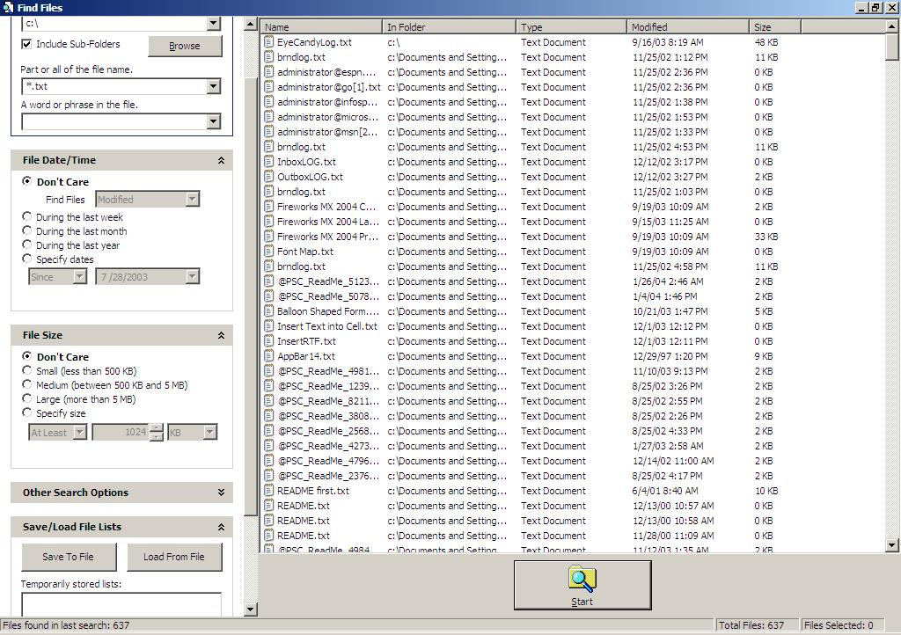



## VBFind

### Description

This code replaces XP find, and also provides functionality for creating compressed and/or encrypted composite files. It supports all conceivable search options, with the exception of searching inside of zip files. You may use my code(parts of this code are not mine) in any way you like, commercial or otherwise I don't care. I don't need votes/comments, but I would appreciate any and all bug reports or ideas on improving effeciency.
 
### More Info
 

             |
---                |---
**Submitted On**   |2004-01-28 10:14:26
**By**             |[selftaught](https://github.com/Planet-Source-Code/PSCIndex/blob/master/ByAuthor/selftaught.md)
**Level**          |Intermediate
**User Rating**    |3.0 (12 globes from 4 users)
**Compatibility**  |VB 6\.0
**Category**       |[Files/ File Controls/ Input/ Output](https://github.com/Planet-Source-Code/PSCIndex/blob/master/ByCategory/files-file-controls-input-output__1-3.md)
**World**          |[Visual Basic](https://github.com/Planet-Source-Code/PSCIndex/blob/master/ByWorld/visual-basic.md)
**Archive File**   |[VBFind1700841282004\.zip](https://github.com/Planet-Source-Code/selftaught-vbfind__1-51307/archive/master.zip)

